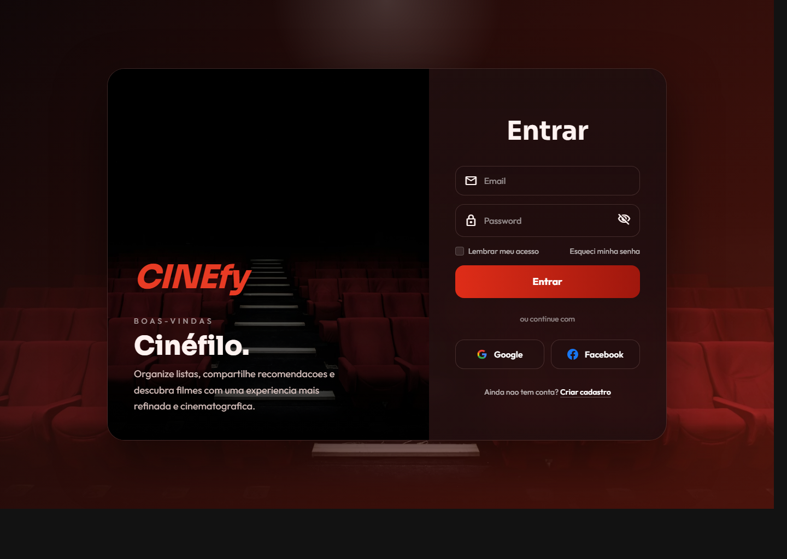
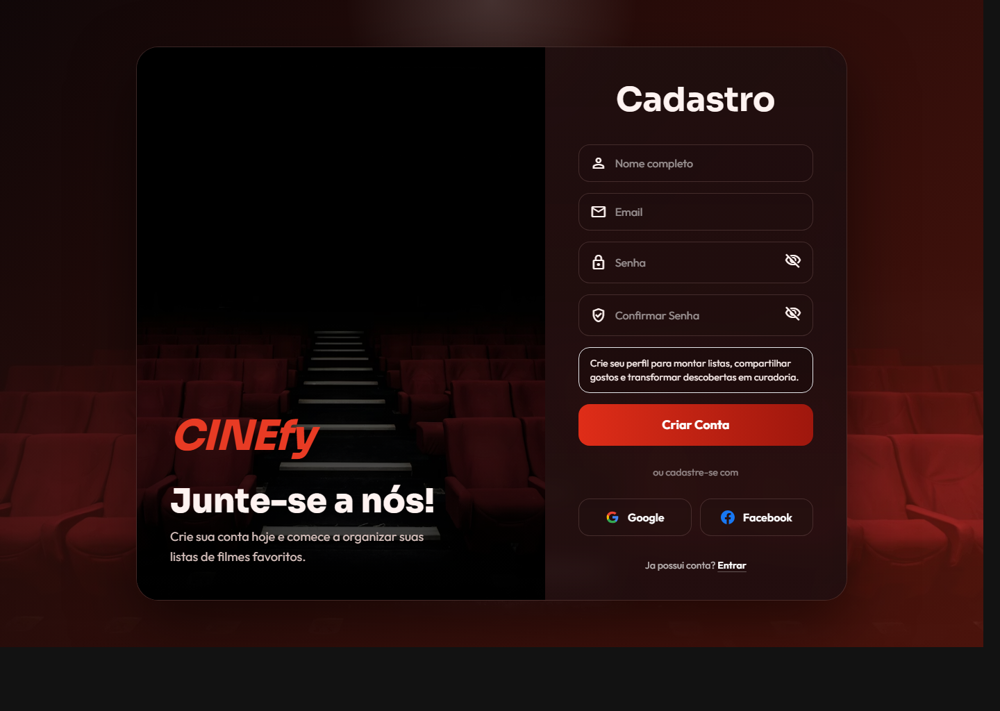

# CINEfy

<p align="center">
  
</p>

<p align="center">
  Plataforma web para descobrir filmes, montar listas personalizadas, compartilhar recomendacoes e manter um perfil social com autenticacao via Firebase.
</p>

<p align="center">
  <a href="https://cinefy3-83a9a.web.app">Demo online</a>
  ·
  <a href="https://github.com/Felipe53650/cinefy">Repositorio</a>
</p>

## Sobre o projeto

O CINEfy combina curadoria pessoal com descoberta de filmes. A experiencia foi pensada para permitir que qualquer usuario entre pela home como anonimo, descubra a proposta do produto e, se quiser, siga para login, cadastro, criacao de listas e compartilhamento de recomendacoes.

Hoje a aplicacao conta com autenticacao, perfil de usuario, multiplas listas, amizades, compartilhamento por link e integracao com o TMDB para busca e detalhes de filmes.

## Destaques

- autenticacao com email e senha, Google e Facebook
- home publica com navegacao para usuarios anonimos
- perfil com avatar, bio e preferencias
- multiplas listas personalizadas por usuario
- compartilhamento publico de listas por link
- busca de filmes e detalhes via TMDB
- sistema de amizades e pedidos entre usuarios
- temas visuais personalizaveis
- modo leitor para listas compartilhadas

## Screenshots

<p align="center">
  
</p>

<p align="center">
  
  
</p>

## Stack

- HTML, CSS e JavaScript vanilla
- Tailwind CSS compilado localmente
- Firebase Hosting
- Firebase Authentication
- Cloud Firestore
- TMDB API

## Estrutura

```text
public/                 paginas e assets do front-end
public/assets/js/       autenticacao, estado global, layout e scripts por pagina
public/assets/css/      estilos globais, temas e CSS compilado
functions/              base para funcoes serverless futuras
firestore.rules         regras do Firestore
storage.rules           regras do Storage
firebase.json           configuracao do Hosting e headers
```

## Rodando localmente

1. Instale as dependencias:

```powershell
npm install
```

2. Gere o CSS:

```powershell
npm run build:css
```

3. Rode pelo Firebase Emulator:

```powershell
firebase emulators:start --only hosting
```

Se preferir Live Server, abra `public/index.html` a partir da pasta `public`.

## Deploy

Para publicar no Firebase Hosting:

```powershell
firebase deploy --only "hosting,firestore:rules"
```

## Arquitetura atual

Hoje o projeto usa Firebase como BaaS. Isso significa que autenticacao, banco e hospedagem ja estao ativos sem um backend tradicional proprio. A base para Cloud Functions ja existe no repositorio e pode ser ativada no futuro para encapsular integracoes externas, como o TMDB, quando a infraestrutura migrar para Blaze.

## Proximos passos naturais

- mover a chave do TMDB para Cloud Functions
- salvar imagens reais no Firebase Storage
- ativar App Check
- evoluir metadados dinamicos e SEO avancado

## Autor

Felipe De Oliveira Santos
