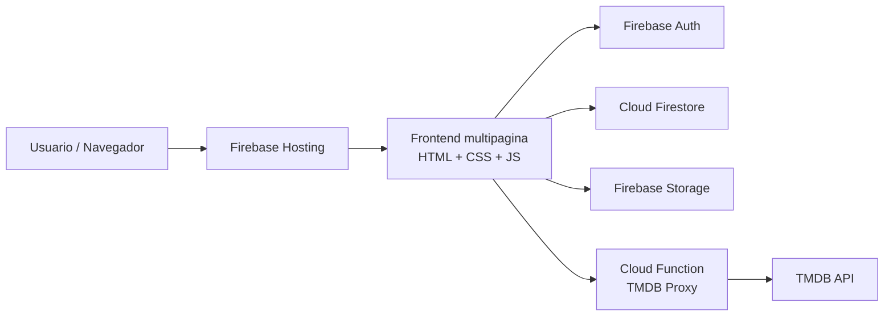
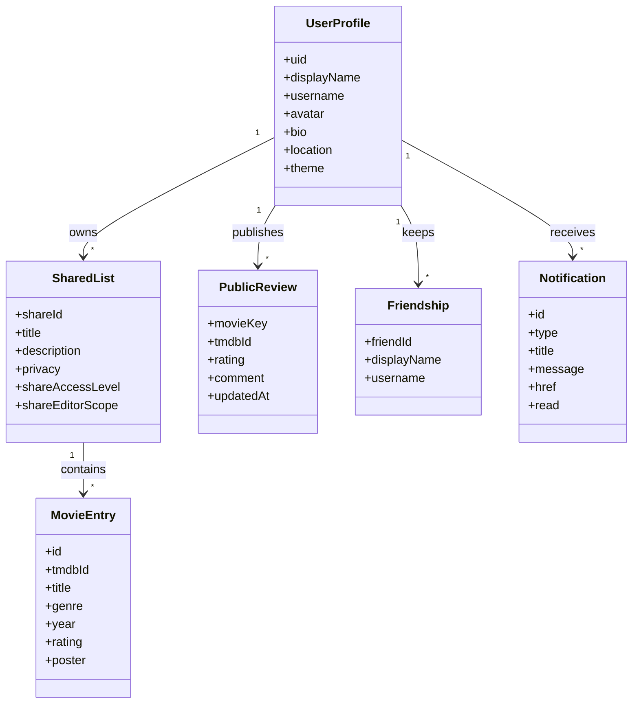
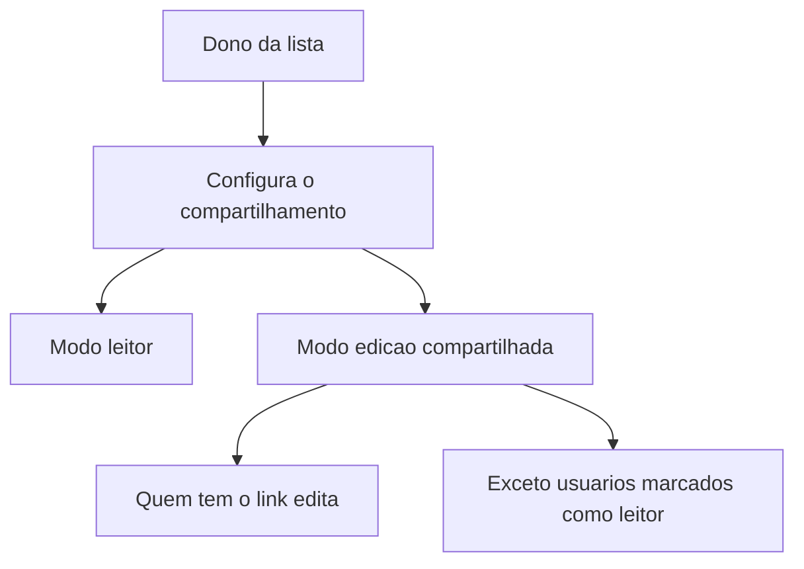

# Arquitetura do Cinefy Club

Este documento resume a arquitetura atual do projeto e ajuda a orientar futuras evolucoes.

## 1. Visao de sistema

## 2. Papel de cada camada

### Frontend

Responsavel por:

- navegacao entre telas
- renderizacao de listas, perfis e reviews
- estado local e sincronizacao de UI
- interacao com Firebase e TMDB Proxy

### Firebase Auth

Responsavel por:

- login com email e senha
- login social com Google e Facebook
- sessao autenticada

### Cloud Firestore

Responsavel por:

- perfil publico do usuario
- amizades e pedidos
- listas compartilhadas
- reviews publicas
- estado sincronizado da aplicacao

### Firebase Storage

Responsavel por:

- avatar de usuario
- posters enviados manualmente

### Cloud Functions

Responsavel por:

- proteger a chave do TMDB
- normalizar o acesso do frontend ao catalogo externo
- aplicar rate limit e hardening no proxy

## 3. Modelo de dominio

## 4. Compartilhamento de listas

Hoje o compartilhamento pode operar em dois niveis:

- somente leitura
- edicao colaborativa

Quando a lista e colaborativa, o dono escolhe:

- todos com o link podem editar
- todos com o link editam, exceto usuarios marcados como somente leitura

## 5. MVP atual

O MVP funcional do Cinefy Club hoje ja cobre:

- descoberta de filmes
- criacao e organizacao de listas
- reviews pessoais e publicas
- compartilhamento por link
- perfis publicos
- amizade entre usuarios
- identidade visual por tema

## 6. Seguranca estrutural

Pontos importantes da arquitetura atual:

- TMDB passa pelo backend, nao pelo frontend
- regras de Firestore e Storage controlam acesso por recurso
- o frontend nao carrega segredos
- upload de imagens foi limitado por tipo e tamanho
- perfis publicos exibem apenas dados apropriados para a camada social

## 7. Evolucoes recomendadas

- App Check
- testes automatizados de fluxo social
- observabilidade de erros e eventos criticos
- reindexacao e analytics de recomendacao
- enriquecimento futuro com outras fontes externas sem deixar de usar TMDB como base principal
